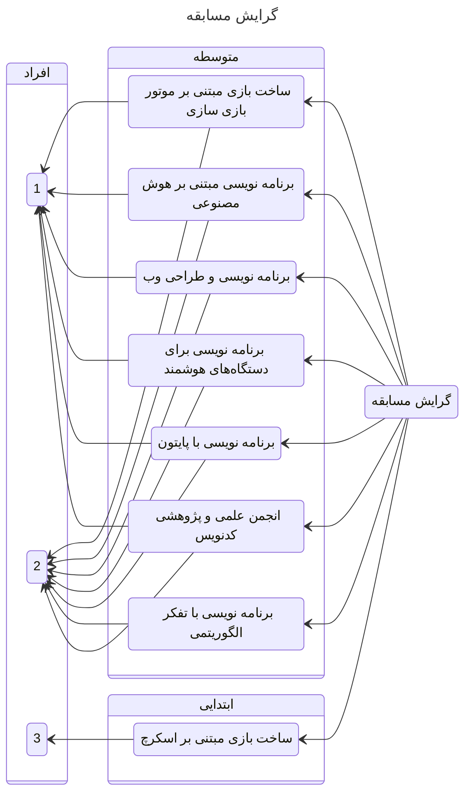

## معرفی مسابقات

### گرایش‌ها

### شرایط عمومی

1. هر تیم مجاز به شرکت در بیش از یک گرایش
2. ارائه آثاری که در سنوات گذشته کسب رتبه شدند مجاز نیست.
3. ارائه آثاری که کسب رتبه نشدند با رفع اشکلات و بهبود مجاز به شرکت هستند.
4. تسلط کامل همه‌ی اعضای تیم به اثر ارائه شده.
5. رعایت ضوابط جشنواره برحسب ماده ۸۵ آیین نامه اجرایی مدارس
6. منابع در دسترس در کانال @codenevisi در شاد
